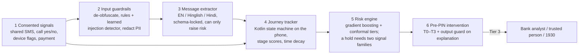
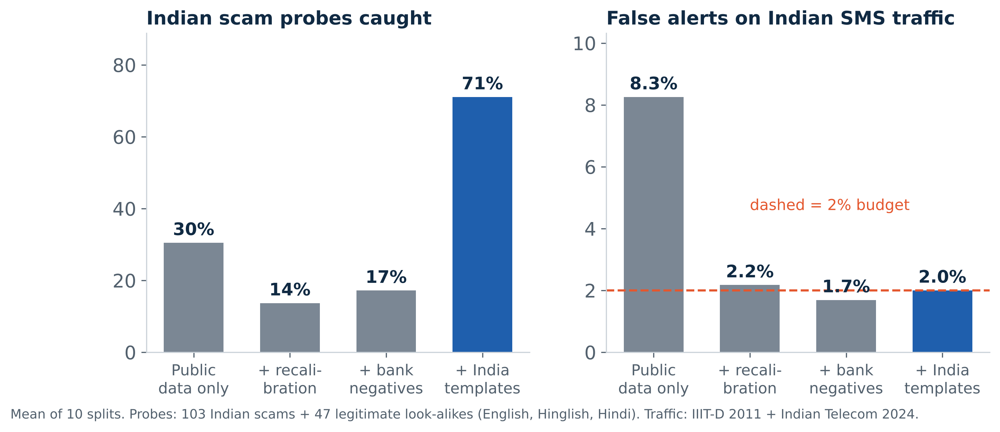
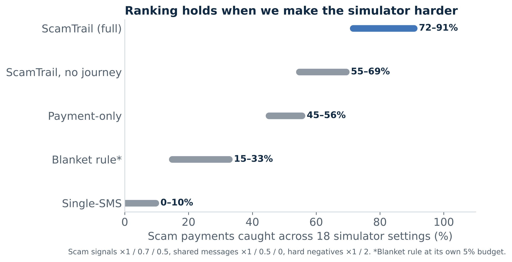
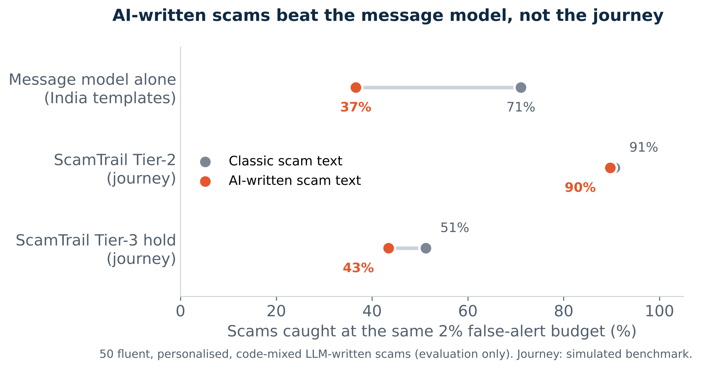

# ScamTrail

**We detect the scam journey, not the scam message.**

ScamTrail is a prototype for UPI scam detection. It runs inside the bank or UPI app (as an SDK) and on the payer bank's server, needs the user's consent, and tracks the whole scam journey (contact → hook → pressure → unusual action → payment). It steps in just before the NPCI PIN pad opens, with graded friction (T0–T3). Guardrails sit around every model input and output.

Every on-device signal is one an Android 11+ bank app can read legally: whether a call is active and whether it is VoIP (`AudioManager` mode, no permission), named remote-access apps (`<queries>`), the Android 15 screen-recording callback, messages the user chooses to share, and payment data the bank already holds. The SDK never reads call logs, contacts or SMS inboxes.

Built for the Amazon AI Cyber Security Hackathon, Track 02 (AI-Driven Scam Pattern Recognition).

## Architecture



| Guardrail | Where | What it does |
|---|---|---|
| `normalise()` | input | undoes zero-width chars, look-alike letters, leetspeak and "K Y C" spacing; protects real UPI IDs, emails and PAN from being altered |
| `detect_injection()` + `injection_model.py` | input | regex rules and a character n-gram detector find text aimed at the model and remove it; a detected injection fixes risk at ≥ 0.9 |
| `redact_pii()` | input | masks phone, UPI, Aadhaar, PAN, card, account, OTP and email; keeps only the domain of a link |
| `Intent` (pydantic) | output | the extractor must return this schema, and anything else is rejected (never read as "safe") |
| `monotonic()` | output | a shared message can only raise a stage score |
| `check_explanation()` | output | blocks "safe", accusations, threats, score leaks and reasons the model did not use; falls back to a fixed template |

## Data

| Data | Role | Size |
|---|---|---|
| Mishra & Soni (2022), *SMS Phishing Dataset*, Mendeley Data ([f45bkkt8pr](https://data.mendeley.com/datasets/f45bkkt8pr)) | training and real-SMS results | 5,831 unique messages |
| `synth_india.py`: India scam and look-alike templates (ours) written from RBI / I4C typologies | training | about 6,000 messages (English, Hinglish, Hindi) |
| IIIT-Delhi Indian SMS (Yadav, Kumaraguru et al., 2011) | **external test only** | 1,982 messages |
| Indian Telecom SMS Spam Collection (2024, MIT) | **external test only** | 2,042 messages |
| spam-scan Indian scam probes (2026, MIT) | **external test only** | 103 scams + 47 legitimate look-alikes |
| `journey_sim.py`: simulated journeys (ours) | journey benchmark | 16,000 users, 161k payments |
| `data/ai_variants.json`: 50 LLM-written scams + 10 look-alikes | **stress test only, never trained on** | 60 messages |

Run `./fetch_external.sh` to download the external sets. Splits are grouped by message template, so near-copies never sit in both train and test. No bank, customer or platform data is used.

## Results

### 1. Real SMS (Mishra & Soni)
| | Value |
|---|---|
| PR-AUC (grouped 5-fold) | 0.95 |
| Measured false alerts at 1% / 2% / 5% targets (20 splits) | 1.0% / 2.0% / 5.4% |
| Smishing caught at a 2% budget | 92% |
| Recall under obfuscation, without guard → with guard | 87–89% → 92–93% |
| PII redaction through the full guard chain (8 types) | 100% |

### 2. Indian external test (no Indian scam message is used for training)


- A model trained on public data alone catches **30%** of Indian scam probes. On Indian SMS traffic its false alerts reach **8.3%**, more than four times the 2% budget.
- Re-setting the threshold on bank traffic (which needs no scam labels) restores the budget, but recall falls to 14%.
- Adding the India typology templates brings recall to **71%** at **2.0%** false alerts: Hinglish ~100%, Hindi 100% (n = 5), English 68%, misspelled 33%. Recall on the original SMS test stays at 87%.
- *Caveat:* we read the probe set while building the templates, so this is a development test, not a blind one. The blind test is bank shadow mode.

### 3. Journey benchmark (legal Android signals only; same 2% false-alert budget for every method)
| Method | Scam payments caught |
|---|---|
| Blanket rule (new payee > ₹10k, its own 5% budget) | 33% |
| Single-SMS classifier | 7% |
| Payment-only model | 53% |
| ScamTrail without journey state | 69% |
| **ScamTrail (full)** | **91%** |

**Tiered friction:**
- Tier 1 is one passive line on the confirm screen (no pause, 3% budget).
- A Tier-2 pause catches 91% of scam payments, with prompts on 2.0% of genuine payments (9% of hard look-alike cases).
- Tier-3 holds need two independent signal families. They hold 51% of scam payments (68% of scam rupees) and reach 84% of scam journeys, while holding 0.28% of genuine payments.
- With no messages shared at all: Tier 2 still 89%, Tier 3 41%.
- By scam type (Tier 2 / Tier 3): task scam 92% / 50%, digital arrest 88% / 70%, KYC scam 74% / 68%.

**What a genuine user sees:** about 10 scored payments a month; on average 0.16 Tier-2 prompts a month (≈ 2 a year) and 86% of users see no prompt or hold in a given month. Prompting on every payment would mean about 115 a year.

**What a bank sees (1M scored payments a day):** at a scam prevalence of 1 in 10,000, about 2,800 Tier-3 holds a day (precision ≈ 1.8%); at 1 in 1,000, about 3,300 (precision ≈ 16%). A blanket new-payee > ₹10k lag would delay about 51,000 payments a day.

**Smarter lag:** applied inside the blanket rule's scope, ScamTrail keeps 95% of the rule's scam catches while releasing 85% of the genuine payments the rule would delay.

### 4. Is the ranking an artefact of the simulator?


We re-ran the benchmark in 18 settings: scam signals at ×1, 0.7 and 0.5; shared messages at ×1, 0.5 and 0; hard negatives at ×1 and 2.
- ScamTrail ranks first in **18 of 18** settings, catching 72–91% of scam payments against 45–56% for payment-only.
- One assumption is not varied: the repeated, growing payments of task scams, which I4C advisories document.

### 4b. AI-written scams


50 scams written by an LLM in the fluent, polite, code-mixed style AI now gives scammers (no "urgent", "KYC", "click here"). Never used for training.
- The message model drops from 71% (classic Indian probes) to **37%** on AI-written scams; it also flags 16% of 10 legitimate look-alikes.
- Swapping every scam text in the journey benchmark for an AI-written one, Tier 2 stays at **90%** (from 91%) and Tier 3 falls from 51% to 43%.
- This is the core argument for journey-level detection: text gets better with AI; calls, remote-access apps and payment patterns do not.

### 5. Prompt injection the rules have never seen
| | Detected |
|---|---|
| Regex rules alone | 17% |
| Regex + learned detector | 45% |

This is tested leave-one-family-out over five injection styles. False triggers on real SMS sentences: 0.1%. Detection is still partial, which is why the LLM never decides: its output is schema-locked and can only raise risk.

## Run it

```bash
pip install -r requirements.txt
./fetch_external.sh          # external Indian test sets
python run_all.py            # every experiment + figures (~20 min)
pytest -q                    # guardrail unit tests
```

## Files

| File | Purpose |
|---|---|
| `guardrails.py` | all input and output guardrails |
| `injection_model.py` | learned injection detector, leave-one-family-out test |
| `message_model.py` | TF-IDF word + character model behind the input guard |
| `synth_india.py` | India scam / look-alike template generator |
| `external.py`, `run_external.py` | Indian external test sets and transfer / adaptation experiment |
| `conformal.py` | split-conformal and Mondrian thresholds |
| `journey_sim.py`, `tracker.py`, `run_journey.py` | journey simulator, kill-chain tracker, benchmark |
| `run_sensitivity.py` | 18-setting stress test of the simulator |
| `run_ai_variants.py` | AI-written scam stress test (message and journey level) |
| `attacks.py` | red-team obfuscation and injection attacks (evaluation only) |
| `tests/` | guardrail unit tests (run in GitHub Actions) |

## Limitations

- Journey results come from a simulator. Real-world performance has to be checked in bank shadow mode.
- At realistic scam prevalence Tier-3 precision is low (≈ 2–16%), so every hold goes to a person and is released after the cooling window if the user proceeds.
- The AI-written test set is small (50 scams, 10 look-alikes) and written by one model.
- The Indian probe set is small (150 messages) and was seen during development. Recall on misspelled scams is low (33%).
- Learned injection detection is partial (45% on unseen styles).
- Per-age and per-language (Mondrian) calibration gave no gain in simulation.
- The prototype uses histogram gradient boosting and occlusion attribution in place of XGBoost and SHAP.
