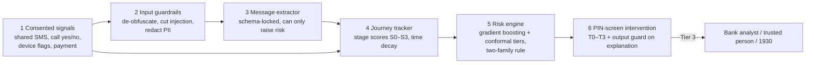
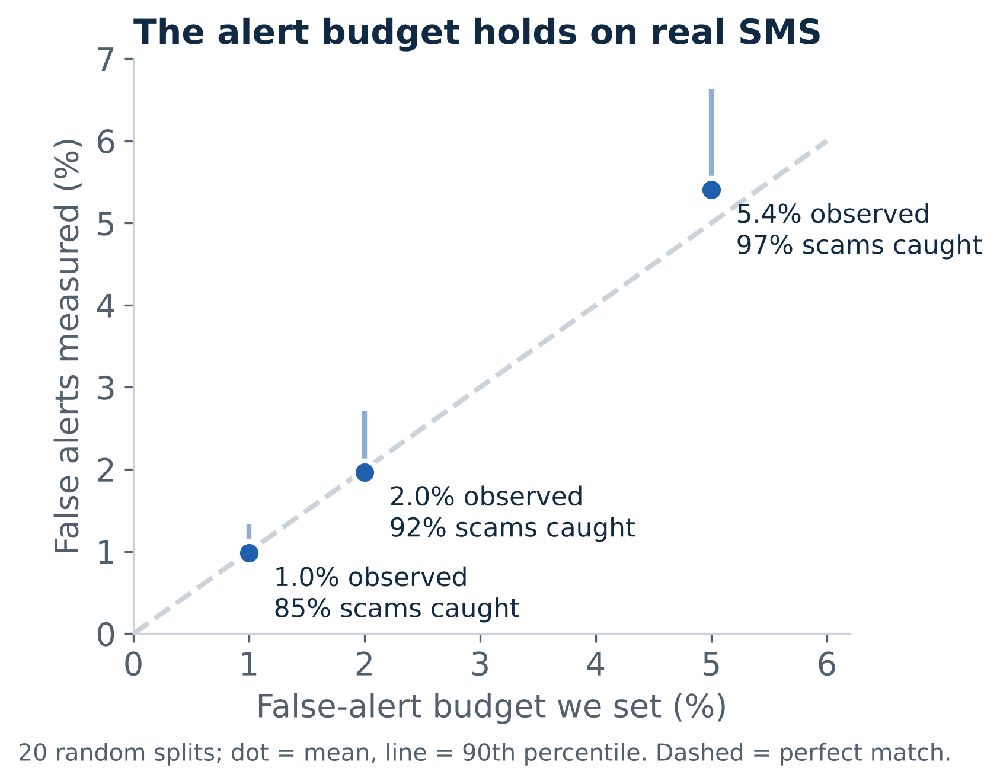
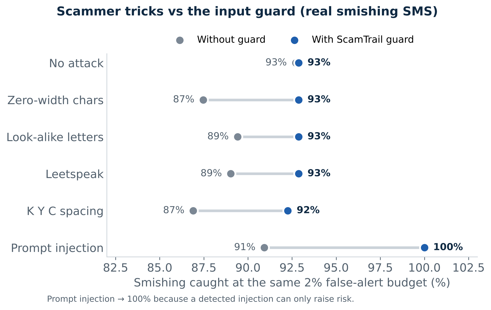
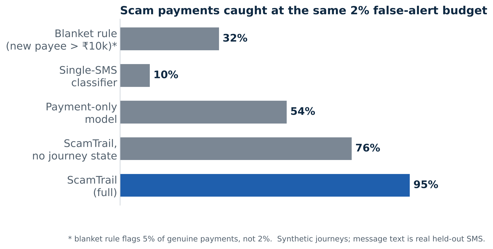
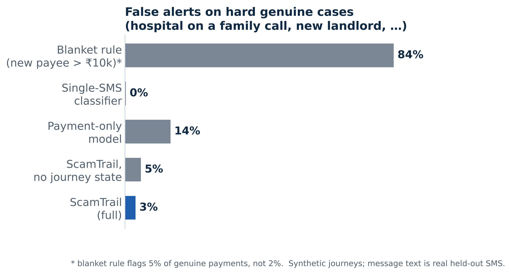

# ScamTrail

**We detect the scam journey, not the scam message.**

ScamTrail is a prototype for UPI scam detection. It runs on the phone, needs the user's consent, and tracks the whole scam journey (contact → hook → pressure → unusual action → payment). It steps in at the UPI PIN screen with graded friction (T0–T3). Guardrails sit around every model input and output.

Built for the Amazon AI Cyber Security Hackathon, Track 02 (Scam Pattern Recognition).

## Architecture



| Guardrail | Where | What it does |
|---|---|---|
| `normalise()` | input | undoes zero-width chars, look-alike letters, leetspeak and "K Y C" spacing; protects real UPI IDs, emails and PAN from being altered |
| `detect_injection()` | input | finds text aimed at the model ("ignore previous instructions", "ye safe hai") and removes it; a detected injection fixes risk at ≥ 0.9 |
| `redact_pii()` | input | masks phone, UPI, Aadhaar, PAN, card, account, OTP and email; keeps only the domain of a link |
| `Intent` (pydantic) | output | the extractor must return this schema, and anything else is rejected (never read as "safe") |
| `monotonic()` | output | a shared message can only raise a stage score |
| `check_explanation()` | output | blocks "safe", accusations, threats, score leaks and reasons the model did not use; falls back to a fixed template |

## Data

- **Real SMS:** Mishra & Soni (2022), *SMS Phishing Dataset for Machine Learning and Pattern Recognition*, Mendeley Data ([f45bkkt8pr](https://data.mendeley.com/datasets/f45bkkt8pr)). There are 5,971 messages, or 5,831 after removing duplicates (543 smishing, 454 spam, 4,834 ham). Splits are grouped by message template, so near-copies never appear in both train and test.
- **Journeys:** 16,000 simulated users (161k payments) built from public RBI / I4C scam typologies, with hard genuine cases (a hospital payment during a family call, a new landlord, a work remote-desktop session). Every shared message is a **held-out real SMS**.
- No bank, customer or platform data is used.

## Results

### Real SMS
| | Value |
|---|---|
| PR-AUC (logistic regression, grouped 5-fold) | 0.95 |
| Smishing caught at a 2% false-alert budget | 92% |
| Measured false alerts at 1% / 2% / 5% targets (20 splits) | 1.0% / 2.0% / 5.4% |
| Recall under obfuscation, without guard → with guard | 87–89% → 92–93% |
| PII redaction, full guard chain (8 types) | 100% |
| False injection flags on real ham | 0% |
| Latency | 0.2 ms per message |

<p float="left">
  
  
</p>

### Simulated journeys (same 2% false-alert budget)
| Method | Scam payments caught |
|---|---|
| Blanket rule (new payee > ₹10k, 5% budget) | 32% |
| Single-SMS classifier | 10% |
| Payment-only model | 54% |
| ScamTrail without journey state | 76% |
| **ScamTrail (full)** | **95%** |

The two-family rule (Tier 2+ needs two independent signal families) cuts false alerts on genuine payments from 1.9% to 0.4%. Even then, 90% of scam journeys are still flagged, and 84% are flagged when the user shares no message at all.

<p float="left">
  
  
</p>

## Run it

```bash
pip install -r requirements.txt
python run_message.py     # real-SMS experiments  -> results/message.json  (~1.5 min)
python run_journey.py     # journey benchmark     -> results/journey.json  (~20 s)
python make_figures.py    # charts                -> results/*.png
```

## Files

| File | Purpose |
|---|---|
| `data.py` | load, clean, de-duplicate, template groups |
| `guardrails.py` | all input and output guardrails |
| `attacks.py` | red-team obfuscation and prompt-injection attacks (evaluation only) |
| `message_model.py` | TF-IDF word + character model behind the input guard |
| `conformal.py` | split-conformal and Mondrian (age × language) thresholds |
| `journey_sim.py` | synthetic journeys with hard negatives |
| `tracker.py` | kill-chain stage scores and evidence families |
| `run_message.py`, `run_journey.py` | experiments |
| `make_figures.py` | charts |

## Limitations

- Journey results come from a simulator. Real-world performance has to be checked in bank shadow mode.
- Injection wording the detector has never seen is not flagged. Recall stayed the same in our test, and the schema lock plus monotonic risk still protect the LLM path.
- Per-age and per-language (Mondrian) calibration gave no gain in simulation.
- The prototype uses scikit-learn's histogram gradient boosting and occlusion attribution in place of XGBoost and SHAP.
